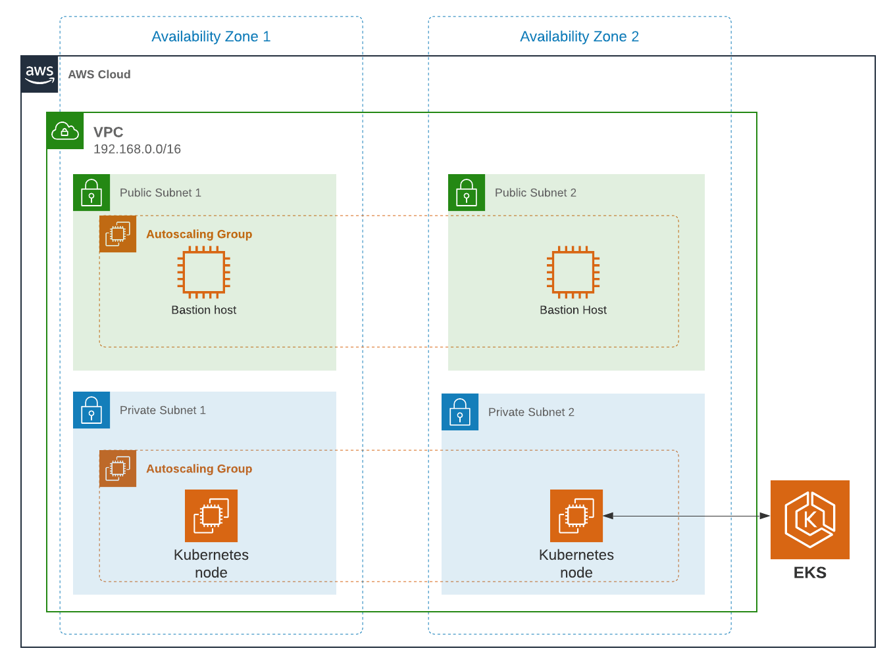
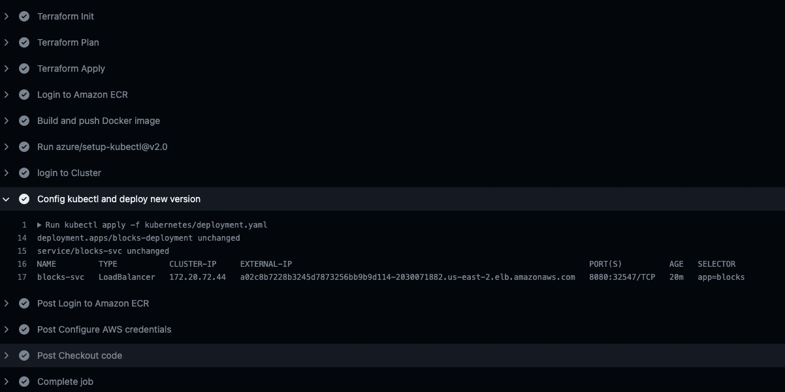

# eks-app

This project will guide you through the process of creating the infrastructure in AWS for a web app with EKS and Terraform.

## Prerequisites

Before you begin, you will need to have the following tools installed on your local machine:

- kubectl
- AWS CLI
- Terraform
- Docker

create your state bucket on aws s3 service and modify if needed the `/terraform/terraform.tf` file

Also you will need to create an s3 bucket to store the terraform state and put the name of this bucket in the `terraform/terraform.tf`



## In the end of this process you should see in your browser (YOU CAN PLAY PRESSING s)


## Pipeline (automated version to deploy)

This project includes a GitHub Actions pipeline that performs the following steps:

1. Runs `terraform init`, `terraform plan`, and `terraform apply` to create the infrastructure in AWS.

2. Builds the Docker image and pushes it to the ECR repository.

3. Applies the kubernetes manifests to deploy the web app to the EKS cluster.

4. look for the `EXTERNAL-IP` in your github actions pipeline, copy the endpoint, paste it in your browser finishing with `:8080` port and there you have your application running in your eks cluster



To use the pipeline, create a new GitHub Actions workflow and reference the provided `pipeline.yml` file. Make sure to set the necessary environment variables in the workflow. (AWS_ACCESS_KEY_ID and AWS_SECRET_ACCESS_KEY)

If you want to reproduce this pipeline, first store your secrets in your github actions secrets and push all the content from this repo as forking wont allow you to run workflows.

## Manual version to deploy 

1. Navigate to the terraform directory of the project.

2. store the following configuration to your ~/.aws/credentials file
```
[default]
aws_access_key_id = <YOUR-KEY-ID>
aws_secret_access_key = YOUR-ACCESS-KEY
```

3. `terraform init`, `terraform plan`, and `terraform apply` to create the infrastructure in AWS.

4. Run `aws ecr get-login-password --region us-east-2 | docker login --username AWS --password-stdin <AWS-ACCOUNT>.dkr.ecr.us-east-2.amazonaws.com` to log in to your ECR repository.

5. Go back to the root folder and run `docker build -t my-app .` to build the Docker image.

6. Run `docker tag my-app <AWS-ACCOUNT>.dkr.ecr.us-east-2.amazonaws.com/blocks57:latest` to tag the Docker image.

7. Run `docker push <AWS-ACCOUNT>.dkr.ecr.us-east-2.amazonaws.com/blocks57:latest` to push the Docker image to the registry.

8. Go to the `kubernetes` folder and run `aws eks --region us-east-2 update-kubeconfig --name blocks57-eks` to login to the eks cluster

9. run `kubectl apply -f deployment.yaml`

10. run `kubectl get svc -o wide blocks-svc` to get the endpoint where the app is exposed and concatenate it with `:8080`, paste the url in your browser and there it is

## delete infrastructure

1. make sure to delete all ecr images published

2. make sure to delete the `/kubernetes/deployment.yaml` before destroy

3. `terraform init`, `terraform destroy`  